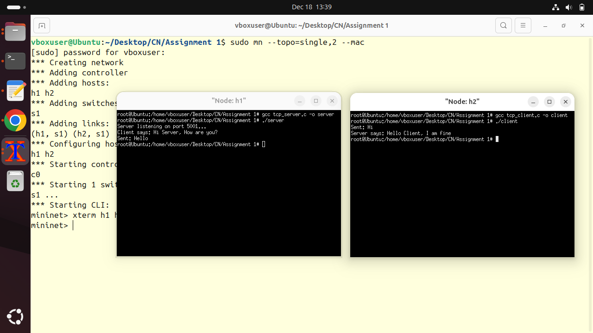

# Computer Networks Lab

This repository contains implementations for **Computer Networks Laboratory assignments**.
Each section below lists **only the problem statement (question)** as given in the lab manual.
**Outputs, screenshots.**

---

## Assignment 1: TCP Client–Server (Basic)

### Objective

To gain first hands-on experience of basic socket programming.

### Question

Write a program to run TCP client and server socket programs where the client first says **"Hi"** and in response the server says **"Hello"**.

### Output

---
## Assignment 2: TCP Socket Programming (Multi-client Application)

### Objective

To gain experience of TCP socket programming for simple applications.

### Question

Write a program using TCP sockets to implement the following:

* Server maintains records of fruits in the format: fruit-name, quantity, last-sold (server timestamp)
* Multiple clients purchase fruits one at a time
* Fruit quantity is updated after every sale
* Server sends a regret message if requested quantity is not available
* Server displays customer IDs ⟨IP, Port⟩ who have completed transactions
* Server displays the total number of unique customers after each transaction

### Output

---
## Assignment 3: UDP Socket Programming

### Objective

To gain experience of UDP socket programming for simple applications.

### Question

Redo **Assignment 2** using **UDP sockets** instead of TCP sockets.

### Output

---
## Assignment 4: Packet Capture and Protocol Analysis

### Objective

To gain knowledge of packet capturing tools and understand header structures.

### Question

Install Wireshark in a virtual machine environment. Capture packets during a **PING** operation and:

* Draw a time diagram showing protocol steps
* List L2, L3, and L4 header fields extracted from the captured `.pcap` file

### Output

---
## Assignment 5: Packet Generation Tools

### Objective

To gain knowledge of packet capturing and generation tools.

### Question

Learn and use the maximum number of packet generation tools such as **iperf**, **D-ITG**, etc., and generate traffic between Mininet hosts.

### Output

**Decode(D-itg_file)**

**D-ITG(gen_netTraffic_test_netPerfor)**
<

**hping3(flood_custom_net_packets)**

**output_ass5_iperf3(speed,thourghtput_test)**

---
## Assignment 6: TCP/IP Libraries in C

### Objective

To gain knowledge of TCP/IP C libraries.

### Question

Develop a simple C-based network simulator to analyze TCP traffic by:

* Listening to incoming packets at the Ethernet port
* Extracting headers and data from incoming packets

### Output

---
## Assignment 7: UDP-Based Scientific Calculator

### Objective

Client–server communication using UDP packets.

### Question

Write a UDP client–server program where:

* Client sends one or two numbers and a scientific operation (sin, cos, +, -, *, /, inverse, etc.)
* Server evaluates the expression and sends back the result
* Packet loss is detected using Wireshark in Mininet

### Output

---
## Assignment 8: Multi-threaded TCP Chat Server

### Objective

Using thread library and TCP sockets.

### Question

Write a C program using threads and TCP sockets to build a **group chat server** where:

* Multiple clients communicate through the server
* Each client is handled by a separate server thread
* Server maintains a message log with timestamps
* All clients receive messages in real time

### Output

---
## Assignment 9: File Upload and Download Using TCP

### Objective

File upload and download using TCP.

### Question

Write a TCP client–server program for:

* Downloading a file from server to client
* Uploading a file from client to server
* Measuring transfer time using `time.h` on both client and server sides

### Output

---
## Assignment 10: RAW Socket Packet Generation

### Objective

Using RAW sockets to generate packets.

### Question

Write two C programs using RAW sockets to:

* Send a TCP packet containing your roll number in the payload
* Send ICMP timestamp messages to a target IP

### Output

---
## Assignment 11: TCP SYN Flood Attack Using RAW Sockets

### Objective

Using RAW sockets to generate TCP flooding attack.

### Question

Write a RAW socket program to generate a **TCP SYN flood DDoS attack** using:

* One attacker host
* One victim host
* Four spoofed agent hosts in Mininet

### Output

---
## Assignment 12: ICMP Flooding Attack Using RAW Sockets

### Objective

Using RAW sockets to generate ICMP flooding attack.

### Question

Implement the same flooding attack as Assignment 11 using **ICMP packets** instead of TCP.

### Output

---
## Assignment 13: Packet Analysis in Custom Topology

### Objective

To learn packet capturing and analysis.

### Question

Create a **binary tree topology** with 7 switches in Mininet and:

* Capture packets at the root switch during a PING operation
* Extract headers using a C program
* Draw a time diagram of protocol activity
* List L2, L3, and L4 protocols identified

### Output

**Analysing the Packets**

**Capturing the Packets**

---
## Assignment 14: Custom Mininet Topology

### Objective

Creating customized topologies in Mininet.

### Question

Create a **scalable leaf–spine topology** in Mininet using Python and Mininet APIs. A reference to fat-tree topology may be used.

### Output

**Default Topology**

**Scale-Up Radix**

### Notes

* All programs are expected to run in a **Linux + Mininet** environment.
* Screenshots, `.pcap` files, and execution outputs are be added in the respective assignment folders.
